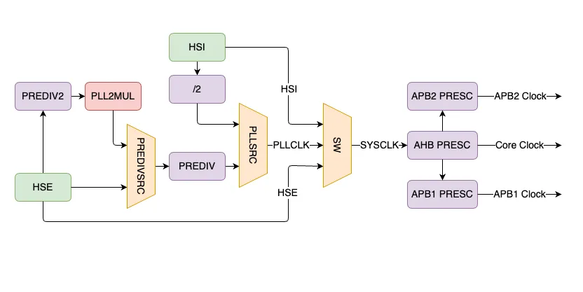

# stm32f407-disc-board-drivers
Building cortex-m4-based MCU's drivers from my point of view, showing my understanding through implementation and well-documented code.

## RCC 
#### Clock Sources: Mainly

- On-Chip RC Oscillator   **Least Precise**
- Externally Connected Crystal   **Most Precise**
- Phase Locked Loop (PLL)   **Programmable**

#### Three different clock sources can be used to drive the system clock (SYSCLK):

1. HSI oscillator clock
2. HSE oscillator clock
3. Main PLL (PLL) clock

The devices have the two following secondary clock sources:

1. **32 kHz low-speed internal RC (LSI RC)** which drives the independent watchdog and, optionally, the RTC used for Auto-wakeup from the Stop/Standby mode.
2. **32.768 kHz low-speed external crystal (LSE crystal)** which optionally drives the RTC clock (RTCCLK) 

Each clock source can be switched on or off independently when it is not used, to optimize power consumption.

### The Speeds of each bus

Several prescalers are used to configure the AHB frequency, the high-speed APB (APB2) and the low-speed APB (APB1) domains.

- The maximum frequency of the **AHB** domain is **168 MHz**.
- The maximum allowed frequency of the high-speed **APB2** domain is **84 MHz**.
- The maximum allowed frequency of the low-speed **APB1** domain is **42 MHz**.

### All peripheral clocks are derived from the system clock (SYSCLK) except for:

- The USB OTG FS clock (48 MHz)
- random analog generator (RNG) clock (≤ 48 MHz)
- SDIO clock (≤ 48 MHz)

which are coming from a specific output of PLL (PLL48CLK) 

- The I2S clock

To achieve high-quality audio performance, the I2S clock can be derived either from a specific PLL (PLLI2S)   or from an external clock mapped on the I2S_CKIN pin.

- The USB OTG HS (60 MHz) clock which is provided from the external PHY
- The Ethernet MAC clocks (TX, RX and RMII) which are provided from the external PHY.
    - When the Ethernet is used, the AHB clock frequency must be at least 25 MHz.

---
## SysTick
- Used for taking actions periodically (often used for OS)
- 24-bit down counter
- Driven by the processor clock ( System Clock  || System Clock /8 )
    - The RCC feeds the external clock of the Cortex System Timer (SysTick) with the AHB clock(HCLK) divided by 8.
        - The SysTick can work either with this clock [or with the Cortex clock (HCLK).

#### SysTick Registers

##### 1. SYST_CSR (SysTick Status & Control Register)

- Configures the SysTick clock source.
- Enables/Disables Interrupts.
- Enable/Disable SysTick Counter.

- Bit[16] : Returns → 1 if timer counted to 0 since last time this was read.
    - It returns 0 if the SYST_CVR is written with any value.
- Bit[2] : Indicates the Clock Source
    - 0 → External Clock
    - 1 → Processor Clock
- Bit[1] : Enables SysTick Exception Request
    - 0 → Counting down to 0 does not assert exception request
    - 1 → Counting down to 0 assert exception request
        - Software can use COUNTFLAG to determine if SysTick has ever counted to zero.
- Bit[0] : Enables The Counter
    - 0 → Disabled
    - 1 → Enabled

**When ENABLE is set to 1, the counter loads the RELOAD value from the SYST_RVR register and then counts down. On reaching 0, it sets the COUNTFLAG to 1 and optionally asserts the SysTick depending on the value of TICKINT. It then loads the RELOAD value again, and begins counting.**

##### SYST_RVR (SysTick Reload Value Register)

- Bit[0-23] : Value to be loaded to the counter When Enabled and When it reaches 0.
- **If the SysTick interrupt is required every 100 clock pulses, set RELOAD to 99.**
- 

##### SYST_CVR (SysTick Current Value Register)

- Contains the current value of the SysTick Counter.

- Bit[0-23] : Reads the current value of the SysTick Counter.
- A write of any value clears the field to 0, and also clears the *SYST_CSR_COUNTFLAG* bit to 0.

##### **SYST_CALIB (SysTick Calibration Value Register)**

#### Delay Achieved

$Delay\space Achieved\space = N×{1\over SYSCLK} = {N\over SYSCLK}$ 

- **If the SysTick interrupt is required every 100 clock pulses, set RELOAD to 99.**

---

#### Usage Hints and Tips

The SysTick counter reload and current value are not initialized by hardware. This means the correct initialization sequence for the SysTick counter is:

1. Program reload value.
2. Clear current value.
3. Program Control and Status register.
